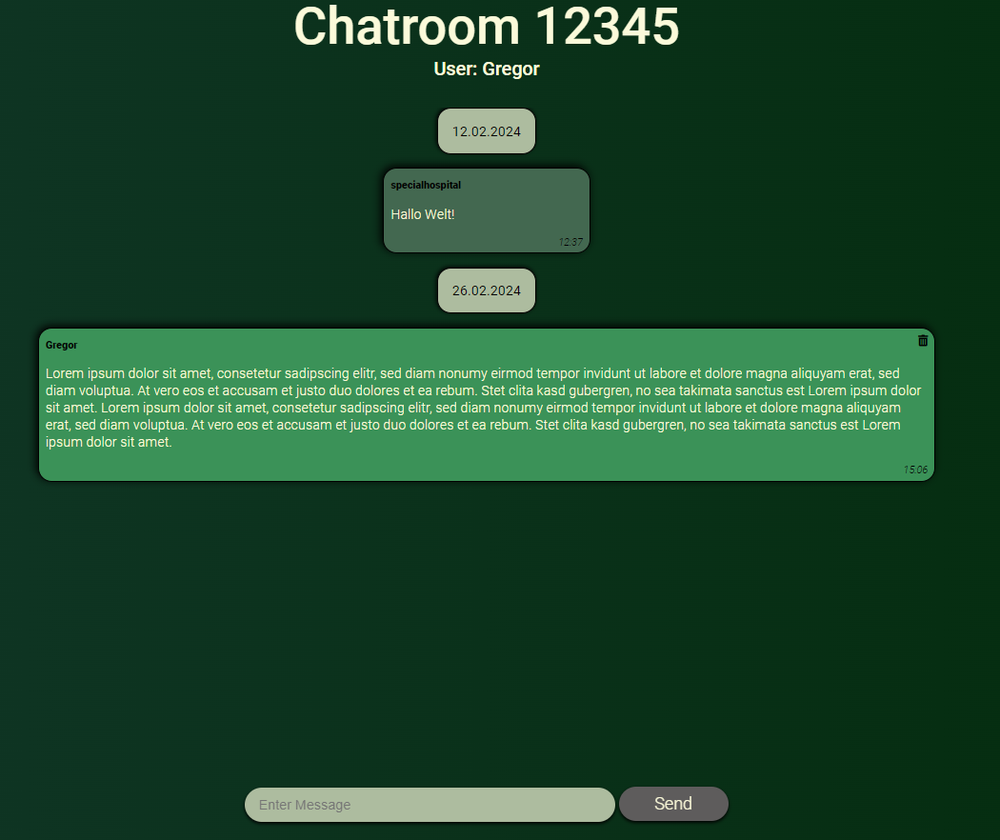

# Whisper Sphere: Anonymous Chat Application with Server-Side Rendering (SSR)

Welcome to Whisper Sphere, the anonymous chat application that allows users to connect anonymously and chat in real-time. Our server utilizes Server-Side Rendering (SSR) to render the user interface and provide functionality.

## Features

- **Anonymous Chatting**: Users can connect with others without registration or login and exchange messages.
- **Easy-to-Use**: The user interface is intuitively designed to ensure a smooth chat experience.

## Installation

1. **Clone the Repository**: `git clone https://github.com/your-username/whisper-sphere.git`
2. **Install Dependencies**: `npm install`
3. **Start the Server**: `npm start`
4. **Open Your Browser**: Visit `http://localhost:3000` in your web browser to start the chat application.

## Usage

- Open the chat application in your preferred web browser.
- Create a Room: Create a chatroom with a password. If no password is provided, one will be generated automatically.
- Enter a room ID with password and join the chat room.
- Optionally, you can also specify a username, otherwise one will be generated automatically.
- Type your messages in the input field and send them.
- Enjoy chatting with other anonymous users!

## Technology

This project uses the following technologies:

- **Node.js**: Server environment for running the application.
- **Express.js**: Web framework for handling HTTP requests and responses.

## Contribution

Contributions are welcome! If you have suggestions for improvements or have found any bugs, please create an issue or send us a pull request.

## License

This project is licensed. For more information, see the LICENSE file.
